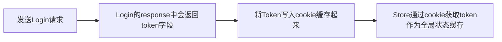

API接口规则
====

## API response数据结构

```
{
  errno: 0正确，其他都是错误码,
  errmsg: 错误信息,
  data: JSON对象
}
```

## 采用Token方式保持登录状态

### Token的获取方式


```mermaid
  graph LR
  A[发送Login请求] --> B[Login的response中会返回token字段]
  B --> C[将Token写入cookie缓存起来]
  C --> D[Store通过cookie获取token作为全局状态缓存]
```


